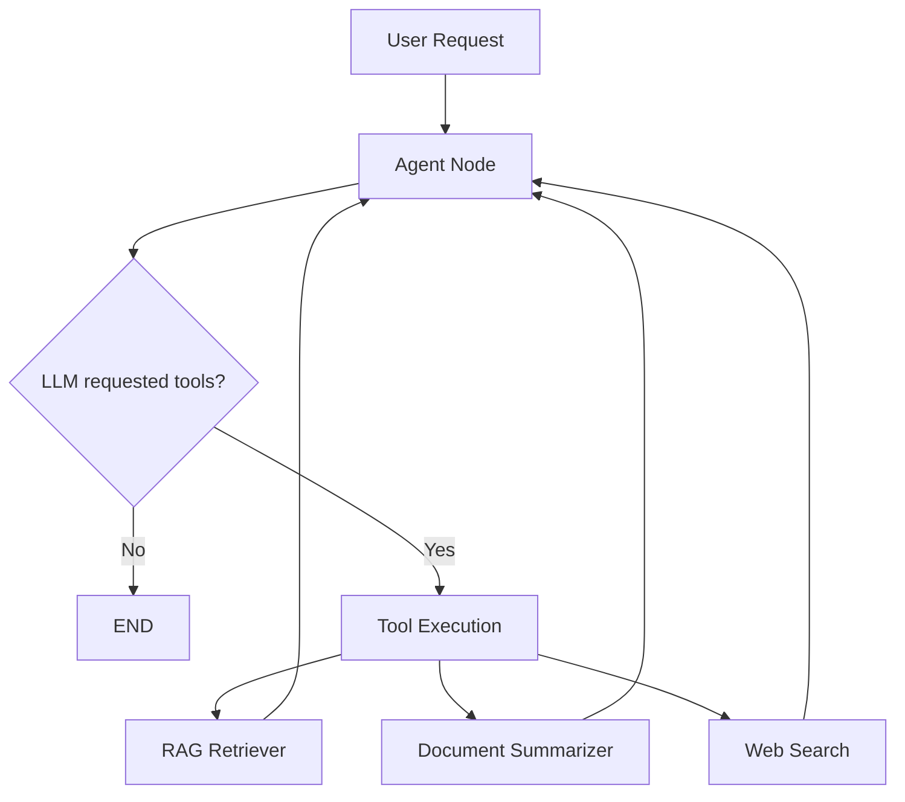

# TaskPilot — Architecture Document

## Overview

TaskPilot is a multi-tool AI agent designed to answer user questions by dynamically selecting
the appropriate tool or combination of tools based on the nature of each query.

The system is built around three core principles:
1. **Retrieval-Augmented Generation (RAG)** for grounded, citation-backed answers from uploaded documents.
2. **Hierarchical summarization** for handling long-document distillation.
3. **Live web search** for current, public information beyond the document corpus.

---

## System Architecture

```
┌─────────────────────────────────────────────────────────┐
│                     Browser Client                       │
│            React + TypeScript + Vite                     │
│                                                          │
│  ┌─────────────────────────────────────────────────┐    │
│  │  src/services/api.ts  (centralised HTTP client)  │    │
│  └─────────────────────────────────────────────────┘    │
└──────────────────────────┬──────────────────────────────┘
                           │  HTTP / REST
                           ▼
┌─────────────────────────────────────────────────────────┐
│                  FastAPI Backend                          │
│                                                          │
│  ┌──────────┐  ┌─────────────┐  ┌───────────────────┐  │
│  │  /api/   │  │   /api/     │  │     /api/          │  │
│  │  health  │  │  documents  │  │     chat           │  │
│  └──────────┘  └─────────────┘  └────────┬──────────┘  │
│                                           │              │
│  ┌────────────────────────────────────────▼────────┐    │
│  │                LangGraph Agent                   │    │
│  │                                                   │    │
│  │   Input query                                     │    │
│  │       │                                           │    │
│  │       ▼                                           │    │
│  │   Router Node (Gemini decides)                    │    │
│  │       │                                           │    │
│  │   ┌───┴──────────────┬───────────────────┐       │    │
│  │   ▼                  ▼                   ▼       │    │
│  │ RAG Tool      Summarizer Tool     Web Search     │    │
│  │   │                  │            Tool (Tavily)  │    │
│  │   └──────────────────┴───────────────────┘       │    │
│  │                       │                           │    │
│  │                  Final Answer                     │    │
│  └───────────────────────────────────────────────────┘   │
└─────────────────────────────────────────────────────────┘
                           │
              ┌────────────┴────────────┐
              ▼                         ▼
┌─────────────────────┐    ┌───────────────────────────┐
│   FAISS Vector Store │    │   Local File Storage       │
│   data/vector_store/ │    │   data/uploads/            │
│  Sentence Transformers    └───────────────────────────┘
│  all-MiniLM-L6-v2    │
└─────────────────────┘
```

---

## Component Descriptions

### Frontend (React + TypeScript + Vite)
- Single-page application with sophisticated dark theme
- Modular components (`ChatWindow`, `DocumentUploader`, `ToolBadge`)
- Custom React Hooks (`useChat`, `useDocuments`) for state management
- Communicates exclusively through `src/services/api.ts`
- `VITE_API_BASE_URL` environment variable controls the backend origin
- Vite dev-server proxy eliminates CORS friction during development

### FastAPI Backend
- **`app/main.py`** — Application factory. Creates the FastAPI instance, registers middleware, mounts routers, and handles the application lifespan.
- **`app/core/config.py`** — `Settings` class (Pydantic Settings). Single source of truth for all environment-driven configuration.
- **`app/core/logging.py`** — Centralised logging setup. Secrets are never logged.
- **`app/api/health.py`** — `GET /api/health` liveness probe.
- **`app/api/documents.py`** — Upload, list, delete, and semantic search routes.
- **`app/api/chat.py`** — Agent chat route with configuration/provider error handling.
- **`app/models/schemas.py`** — Pydantic response models shared across routes.
- **`app/services/`** — Business logic layer between API routes and AI components.
- **`app/agent/`** — LangGraph `StateGraph` definition and typed state.
- **`app/tools/`** — Individual tool implementations.
- **`app/rag/`** — Vector store management, loaders, and chunking.

### LangGraph Agent
The agent uses a `StateGraph` with conditional routing. The implementation has one
agent node and one tool node; the LLM's `AIMessage.tool_calls` determines whether the
conditional edge enters the tool node or reaches `END`:

```python
graph = StateGraph(AgentState)
graph.add_node("agent", agent_node)
graph.add_node("tools", tool_node)
graph.add_conditional_edges("agent", should_continue)
graph.add_edge("tools", "agent")
```

### RAG Pipeline
1. User uploads PDF/DOCX
2. `langchain.document_loaders` parses the file
3. `RecursiveCharacterTextSplitter` chunks the text
4. `sentence-transformers/all-MiniLM-L6-v2` produces embeddings locally
5. Vectors stored persistently in FAISS at `data/vector_store/`
6. At query time: top-K chunks retrieved and injected into the LLM context

### Tools
| Tool              | Implementation       | Phase |
|-------------------|---------------------|-------|
| RAG Retriever     | FAISS + LangChain   | 2     |
| Doc Summarizer    | LangChain map-reduce | 2    |
| Web Search        | Tavily API          | 3     |

---

## Data Flow - Query Lifecycle

```
User message
    │
    ▼
POST /api/chat
    │
    ▼
LangGraph agent receives query + conversation history
    │
    ▼
Router node (Gemini) classifies intent:
  - "Answer directly"  → LLM generates response
  - "Need documents"   → RAG Retriever tool
  - "Need summary"     → Summarizer tool
  - "Need web info"    → Web Search tool
  - "Multi-step"       → chain multiple tools
    │
    ▼
Tool(s) called → results returned
    │
    ▼
Final answer synthesized with citations
    │
    ▼
HTTP `ChatResponse` returned to frontend
```

---

## State, Memory, and Scope

`AgentState.messages` uses LangGraph's `add_messages` reducer so new turns append to
the checkpointed conversation. `active_document_ids` is supplied on every API request
and is overwritten for that invocation, so a previous document selection does not leak
into a later turn. `tool_trace` and `sources` are reset per response while messages
remain persistent. The session ID becomes the checkpointer `thread_id`; New Chat clears
the frontend session ID and starts a new thread on the next request.

## Source and Tool Trace Flow

Tools create source objects directly. The tool node appends them to `AgentState.sources`.
`AgentService` validates and deduplicates them, then returns them in `ChatResponse`.
Document sources use `(document_id, chunk_id)` for deduplication; web sources use URL.
The trace contains only observable tool name, status, and description. No model scratchpad,
system prompt, or provider secret is returned.

## Security Principles

- API keys are loaded exclusively from environment variables — never hardcoded.
- Secrets are filtered from logs.
- `.env` files are git-ignored.
- The backend can boot without AI API keys in Phase 1.
- AI key validation occurs lazily when AI functionality is first used.
- Upload extensions are allowlisted, filenames are sanitized, stored names are UUID-prefixed,
  and the configured upload-size limit is enforced while streaming the file to disk.
- Uploaded text is treated as untrusted content by summarization prompts; it is not executed.
- External source links use `target="_blank"` with `rel="noopener noreferrer"`.

---

## Phase Roadmap

| Phase | Scope                                                     | Status       |
|-------|-----------------------------------------------------------|--------------|
| 1     | Repository structure, FastAPI, config, logging, tests, React shell | Complete |
| 2     | Document upload, PDF/DOCX parsing, FAISS RAG pipeline     | Complete |
| 3     | LangGraph agent, Gemini integration, Tavily web search, chat UI | Complete |
| 4     | Conversation memory, structured sources, citations UI    | Complete |

---

## Running Locally

```bash
# Backend
cd backend
python -m venv .venv && .venv\Scripts\activate
pip install -r requirements.txt
uvicorn app.main:app --reload --port 8000

# Frontend
cd frontend
npm install && npm run dev
```

---

## Agent Architecture (Phase 3)

TaskPilot uses an explicit LangGraph StateGraph for multi-tool LLM routing:



- **AgentState**: typed dict tracking `messages`, `active_document_ids`, `tool_trace`, and `sources`.
- **Message Flow**: Human messages feed into the Gemini LLM. If the LLM generates `tool_calls`, a conditional edge (`should_continue`) routes to the `tool_node`.
- **Tool Execution**: Tools run asynchronously and append `ToolMessage` results to the state.
- **Checkpointer**: State is preserved across turns via `langgraph-checkpoint-sqlite` (or `MemorySaver`), enabling conversation continuity per `session_id`. Graph and checkpointer creation is lazy so importing the API does not initialize them.
- **Source Tracking**: Isolated from internal model reasoning; actual metadata (document chunks or web URLs) is tracked in the `sources` state field explicitly by the tool nodes.
- **Loop Protection**: Built-in LangGraph recursion limits prevent runaway multi-tool loops.

---

## AgentService HTTP Integration (Phase 4)

The FastAPI application uses `AgentService` as a clean bridge to the LangGraph compiled state graph:

1. **Client**: Sends `POST /api/chat` with `message`, `session_id`, and `document_ids`.
2. **FastAPI**: Validates payload schemas and invokes `run_agent()`.
3. **AgentService**:
   - Generates/validates `session_id` which strictly maps to LangGraph `thread_id` for memory.
   - Converts HTTP `document_ids` into request-scoped `active_document_ids` for the state, actively overriding stale scope from previous turns.
   - Invokes `agent_graph`.
   - Extracts the final text string from the model's message.
   - Deduplicates sources by URL/chunk.
   - Derives `tools_used` from the observable `tool_trace`.
4. **AgentState Memory**: SQLite persistence safely bridges context seamlessly across separate HTTP requests.

