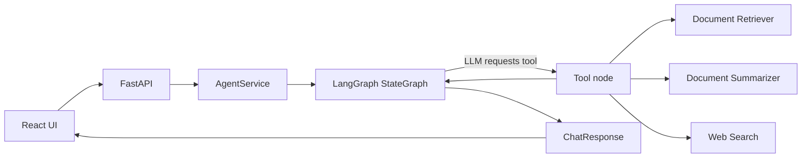

# TaskPilot - Multi-Tool AI Agent

TaskPilot is a multi-tool AI agent that dynamically chooses between document retrieval,
document summarization, web search, and direct reasoning using LangGraph.

TaskPilot is an AI agent that can answer questions using three complementary tools:
**RAG document retrieval**, **document summarization**, and **live web search**.
A LangGraph orchestrator dynamically decides which tool(s) to invoke for each query.

---

## Overview

TaskPilot extends the Inflow AI RAG foundation into an agent workflow. Gemini decides
whether a request needs one of the three tools, multiple tools, or no tool at all.
FastAPI exposes the agent and document APIs, while React provides the Knowledge Base and
chat experience.

## Features

**What is implemented:**
- Clean production-style repository structure
- FastAPI backend with health endpoint (`GET /api/health`)
- Document upload and parsing (PDF, DOCX, TXT, MD)
- Recursive text chunking
- FAISS vector store and embedding pipeline
- Semantic similarity document search (`POST /api/documents/search`)
- SQLite metadata persistence layer
- Centralized Pydantic Settings configuration
- Structured logging system
- React + TypeScript + Vite frontend shell
- **LangGraph StateGraph Agent** (LLM-driven tool selection)
- **RAG Retriever Tool** (semantic search on selected documents)
- **Document Summarizer Tool** (map-reduce summarization)
- **Web Search Tool** (Tavily integration)
- **Conversation Checkpointing** (multi-turn memory via SQLite)
- **Source Tracking & Tool Traces** (isolated from internal reasoning)
- **AgentService HTTP Bridge** (POST `/api/chat` with persistence)
- Backend test suite covering health, RAG, agent, and chat APIs

- **React Interface** (responsive dark theme)
- **Responsive Layout** (Sidebar, document uploads, chat area)
- **Markdown & Source Rendering** (Rich chat bubbles with citations)
- **Tool Traces** (observable activity from backend responses)
- API integration hooks (`useChat`, `useDocuments`)

The current HTTP API is request/response based; the UI shows a truthful loading state until the response arrives.


---

## Technology Stack

| Layer       | Technology                                      |
|-------------|------------------------------------------------|
| Frontend    | React 19 · TypeScript 6 · Vite 8               |
| Backend    | Python 3.12+ · FastAPI · Uvicorn               |
| AI Agent    | LangGraph                                      |
| AI Tools    | LangChain · langchain-google-genai             |
| RAG        | FAISS · Sentence Transformers                 |
| Web Search  | Tavily                                        |
| Config      | Pydantic Settings                              |
| Testing     | pytest · pytest-asyncio                        |

---

## Project Structure

```
TaskPilot/
├── backend/
│   ├── app/
│   │   ├── main.py              # FastAPI app factory + lifespan
│   │   ├── api/
│   │   │   ├── health.py        # GET /api/health
│   │   │   ├── documents.py     # Placeholder — Phase 2
│   │   │   └── chat.py          # Placeholder — Phase 3
│   │   ├── agent/               # LangGraph agent — Phase 3
│   │   ├── tools/               # RAG, Summarizer, WebSearch — Phase 2/3
│   │   ├── rag/                 # Vector store & retrieval — Phase 2
│   │   ├── services/            # Business logic layer
│   │   ├── models/
│   │   │   └── schemas.py       # Pydantic response models
│   │   ├── core/
│   │   │   ├── config.py        # Centralised Settings (pydantic-settings)
│   │   │   └── logging.py       # Logging configuration
│   │   └── utils/
│   ├── tests/
│   │   └── test_health.py       # Health endpoint tests
│   ├── requirements.txt
│   └── .env.example
│
├── frontend/
│   ├── src/
│   │   ├── components/
│   │   │   └── StatusBadge.tsx  # Animated status indicator
│   │   ├── services/
│   │   │   └── api.ts           # Centralised API client
│   │   ├── types/
│   │   │   └── api.ts           # TypeScript interfaces
│   │   ├── App.tsx
│   │   └── main.tsx
│   ├── vite.config.ts
│   └── .env.example
│
├── data/
│   ├── uploads/                 # User-uploaded documents (git-ignored)
│   └── vector_store/            # FAISS index (git-ignored)
│
├── .gitignore
├── README.md
└── ARCHITECTURE.md
```

---

## Backend Setup

### Prerequisites
- Python 3.12+
- pip

### Steps

```bash
# 1. Create virtual environment
cd backend
py -3.12 -m venv .venv_new

# 2. Activate virtual environment
# Windows:
.venv_new\Scripts\activate
# macOS / Linux:
source .venv/bin/activate

# 3. Install dependencies
pip install -r requirements.txt

# 4. Copy and configure environment
cp .env.example .env
# Edit .env; health, docs, and document management work without provider keys

# 5. Run the development server
uvicorn app.main:app --reload --host 0.0.0.0 --port 8000
```

**Backend endpoints:**
- Health check: `GET http://localhost:8000/api/health`
- Swagger docs: `http://localhost:8000/docs`
- ReDoc: `http://localhost:8000/redoc`
- Documents: `GET /api/documents`, `POST /api/documents/upload`, `DELETE /api/documents/{document_id}`
- Document search: `POST /api/documents/search`
- Chat: `POST /api/chat`

### Running Tests

```bash
cd backend
.venv\Scripts\python -m pytest tests/ -v   # Windows
# or:
python -m pytest tests/ -v                  # Unix with venv activated
```

---

## Frontend Setup

### Prerequisites
- Node.js 18+
- npm

### Steps

```bash
# 1. Navigate to frontend directory
cd frontend

# 2. Install dependencies
npm install

# 3. Copy environment file
cp .env.example .env
# VITE_API_BASE_URL=http://localhost:8000 (default — change for production)

# 4. Start development server
npm run dev
```

Frontend runs at: `http://localhost:5173`

> The Vite dev server proxies `/api/*` to the FastAPI backend automatically, so
> CORS is not an issue during development.

---

## Environment Variables

### Backend (`backend/.env`)

| Variable             | Default                        | Required     | Description                        |
|----------------------|--------------------------------|--------------|------------------------------------|
| `APP_ENV`            | `development`                  | No           | `development` / `staging` / `production` |
| `GEMINI_API_KEY`     | *(empty)*                      | Optional for chat | Google Gemini API key           |
| `GEMINI_MODEL`       | `gemini-3.6-flash`             | No           | Gemini model identifier            |
| `TAVILY_API_KEY`     | *(empty)*                      | Optional for web search | Tavily API key              |
| `VECTOR_STORE_PATH`  | `../data/vector_store`         | No           | FAISS index storage path           |
| `UPLOAD_DIR`         | `../data/uploads`              | No           | Document upload directory          |
| `FRONTEND_ORIGIN`    | `http://localhost:5173`        | No           | CORS allowed origin                |
| `MAX_UPLOAD_SIZE_MB` | `20`                           | No           | Max upload file size               |
| `RAG_CHUNK_SIZE`     | `1000`                         | No           | Token chunk size for text splitting |
| `RAG_CHUNK_OVERLAP`  | `200`                          | No           | Chunk overlap                      |
| `RAG_TOP_K`          | `5`                            | No           | Top-k documents to retrieve        |

### Frontend (`frontend/.env`)

| Variable             | Default                     | Description                 |
|----------------------|-----------------------------|-----------------------------|
| `VITE_API_BASE_URL`  | `http://localhost:8000`     | FastAPI backend base URL    |

---

## Example prompts

- "What does the uploaded project report say about the evaluation?"
- "Summarize this document in bullet points."
- "What is the latest public information about ...?"

Without `GEMINI_API_KEY`, document management and health/docs remain available and chat returns a clear configuration error.

More guided scenarios are in [DEMO.md](DEMO.md). Interview preparation is in
[INTERVIEW_GUIDE.md](INTERVIEW_GUIDE.md).

## Architecture



## Limitations and future improvements

- SQLite and local FAISS are intended for local or small deployments.
- Gemini is required for agent chat; Tavily is required for live web search.
- There is no authentication or multi-user workspace isolation.
- Chat is request/response based rather than streamed.
- Natural next steps are streaming, authentication, cloud vector storage, and multi-user workspaces.

## Development

Both servers must be running simultaneously for the full stack:

```bash
# Terminal 1 — Backend
cd backend
.venv_new\Scripts\activate   # or: source .venv_new/bin/activate
uvicorn app.main:app --reload --port 8000

# Terminal 2 — Frontend
cd frontend
npm run dev
```
